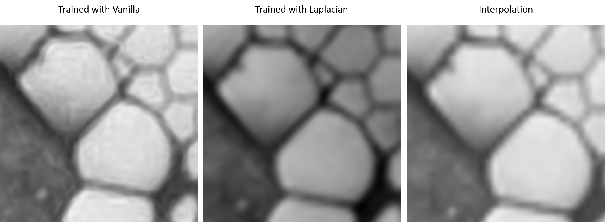

# Siren-Jax
Unofficial implementation of Siren with Jax. This code reproduces image-related results in the original Siren papaer.

## What is Siren?
It is a novel neural network that is proposed in the **Implicit Neural Representations
with Periodic Activation Functions** by Sitzmann et al. 

Siren uses sine functions as activation functions and it can represent continous differentiable signals bettern than networks with other activation functions.

If you want to know more about Siren, please check out the [project page](https://vsitzmann.github.io/siren/).

## Why Jax?

Jax is very fast and convinient for calculating derivatives of a network. Indeed, the training speed is much faster than the Pytorch implementation from the paper. This Jax implementation takes less than 12 minutes for a training, and the original implementation takes 90 minuites for a test as the paper says.

### Speed Test Results

#### Details

- 1 Nvidia RTX 2080 Ti
- Cuda 10.2
- Ubuntu 18.04
- Image size : 256 X 256
- Single Batch

| Vanillla Training | Gradient Training | Laplacian Training |
|-------------------|-------------------|--------------------|
| 110 seconds       |   311 seconds     |   661 seconds      |

## How to use?

### 1. Install Jax
Please follow the [official install guide](https://github.com/google/jax).

### 2. Install packages
```shell
$ pip install -r requirements.txt
```

### 3. Train
This code runs the default training option. Please run ```python train.py -h``` to see other options.
```shell
$ python train.py --file reference.jpg
```

### 4. Test
```shell
$ python test.py --run_name reference
```

## Example Results
This section shows results of *implicite image representation* and *solving Possion equation*.
Training settings are all same unless it is metioned.
- learning rate: 0.0001
- single batch
- 256 X 5 layers
- epoch: 10000 

### Reproducing Paper Results

Results were almost same with the paper.

#### Training with color vanilla image
<ground truth -- vanilla network output>


#### Training with gray vanilla image
<ground truth -- vanilla output -- gradient output -- laplacian output>


#### Training with gradient
<ground truth -- gradient output -- vanilla output -- laplacian output>


#### Training with laplacian
<ground truth -- laplacian output -- vanilla output -- gradient output>


### Batch Effect
The original paper only tested with single batch. I was curious the effect of batch size and I did a test.
- batch size: 16384 (4 batches per epoch)

<trained with vanilla image -- trained with gradient, -- trained with laplacian -- ground truth>


It seems like using batches leads to worse result, as the number of derivative increases. The result of laplacian trained network is very much different with the ground truth image, compare to others.

### Upscale Test

If a network can represent an image in an continous way, then it might be possible to create a higher resolution image. So I created larger images with the trained networks and compared them with an interpolated image.

<trained with vanilla image -- trained with gradient -- trained with laplacian -- interpolated (using PIL)>


The network outputs are not so far better than the interplated image. The gradient trained image is blurry and laplacian trained image's color is not accurate. However, network generated images are much smoother than the interpolated image.

<trained with vanilla image -- trained with laplacian -- interpolated>



These zoomed images. The laplacian trained image is very smooth compare to the interplated image. 

## What is more?

If you are interested in implicit representation, please check out [Awesome Implicit Neural Prepresentations](https://github.com/vsitzmann/awesome-implicit-representations).

The curiosity that led me to reimplement the Jax was that whether it is possible to make a high-resolution image without any other dataset except the source image. Apparently, it does not work by simply genereating a larger image with a network that was trained with a small image. I'm trying some other stuffes, but not sure whether it will work.


